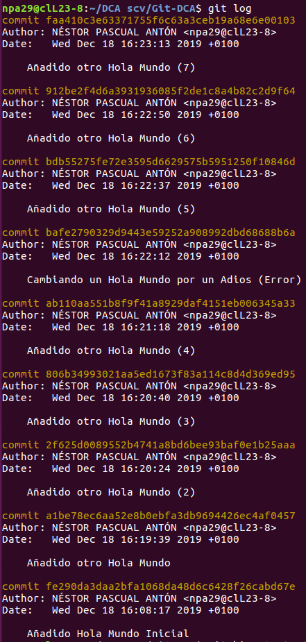
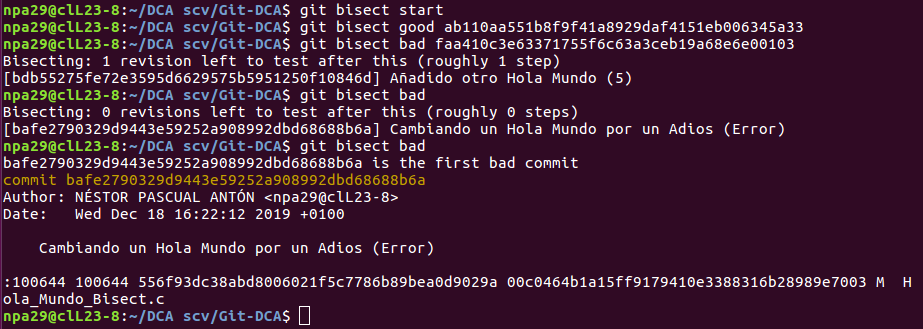

# Practica 10 DCA Github

## Alias
Definidos en el fichero de configuración (`~/.gitconfig`)
 - Globales
   - `git config --global alias.st status`
   - `git config --global alias.br branch`
 - Locales
   - `com = "!git add -A && git commit -m "`

## Bisect

Se ha realizado un Bisect buscando un "error" en el codigo, en este ejemplo el error es representado por un "Adios Mundo" en un programa que imprime muchos "Hola Mundo"

